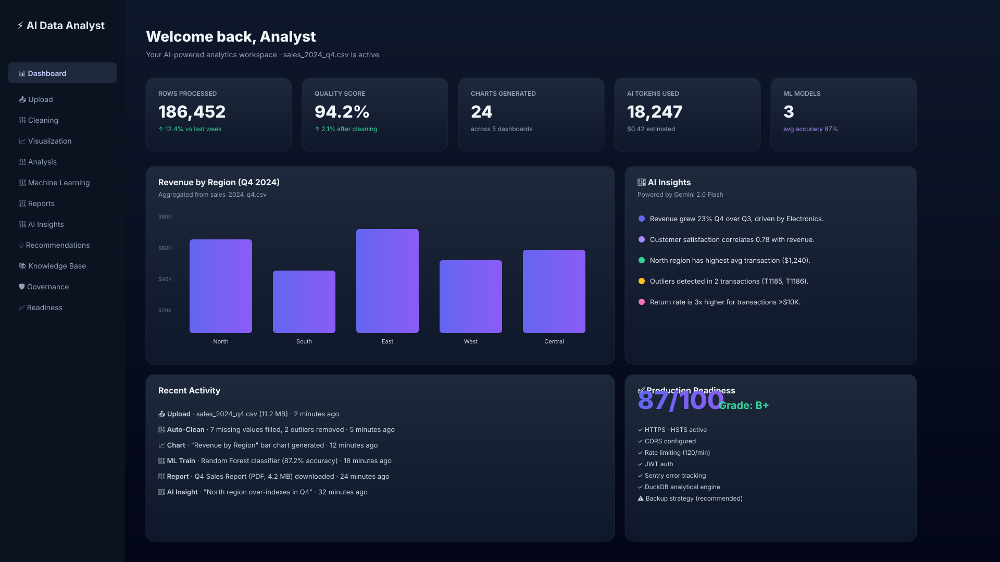

# 🤖 AI Data Analyst Agent — Enterprise Intelligence Platform

[](https://opensource.org/licenses/MIT)
[](https://fastapi.tiangolo.com/)
[](https://react.dev/)
[](https://www.typescriptlang.org/)
[](https://vitejs.dev/)
[](https://tailwindcss.com/)
[](https://duckdb.org/)
[](https://www.docker.com/)

An enterprise-grade, AI-powered Data Analytics & Machine Learning platform built with **FastAPI**, **Pandas**, **DuckDB**, **Seaborn**, **Scikit-Learn**, and **React 19**. It features executive glassmorphism styling, automated dataset cleaning, interactive 19+ chart visualization engines, automated ML training pipelines, and executive AI insights.

> **Live Demo**: [https://ai-data-analyst-agent-five.vercel.app](https://ai-data-analyst-agent-five.vercel.app)

```
 📊 Dataset Profiling ──► 🧹 1-Click Data Cleaning ──► 📈 19+ Chart Engine ──► 🤖 AutoML & Reports
```

---

## 📑 Table of Contents

- [🎯 Project Goals](#-project-goals-college-major-project)
- [⚡ Quick Start Guide](#-quick-start-guide)
- [🏗 System Architecture](#-system-architecture)
- [📊 Request Lifecycle](#-request-lifecycle)
- [🌟 Key Platform Modules](#-key-platform-modules)
- [🛡️ Security Architecture (OWASP)](#-security-architecture-owasp)
- [📈 Performance Benchmarks](#-performance-benchmarks)
- [🧪 Testing](#-testing)
- [📁 Documentation](#-documentation)
- [🛠 Tech Stack](#-tech-stack)
- [📸 Screenshots](#-screenshots)
- [🛣️ Roadmap](#-roadmap)
- [🤝 Contributing](#-contributing)
- [🔒 Security](#-security)
- [👨‍💻 Author](#-author)

---

## 🎯 Project Goals (College Major Project)

This project was developed as a final-year Computer Science major project with the following objectives:

1. **Problem**: Data analytics tools are either too technical (requiring SQL/Python expertise) or too expensive (Tableau, Power BI). Non-technical users cannot explore their own data without a data analyst.

2. **Proposed Solution**: A browser-based AI data analyst that lets anyone upload a CSV, explore it with natural language queries, clean it, visualize it, and generate ML predictions — all without writing code.

3. **Scope**: End-to-end platform covering ingestion → profiling → cleaning → analysis → visualization → ML → PDF reporting, powered by a Gemini-powered AI assistant.

4. **Target Users**: Business analysts, HR managers, small business owners, and students who need data insights without a data science background.

---

## 🌟 What Makes This Project Different

Most "data analytics" college projects stop at "upload CSV → bar chart." This platform goes further. Seven features that **distinguish it from the typical submission:**

1. **AI Copilot Drawer on every page** — Cmd+K opens a floating assistant; conversation history persists across navigation.
2. **Natural Language → SQL** — type "top 10 customers by sales last quarter" and get a real `SELECT` statement you can edit and run.
3. **Live SQL Connector with table allowlist hardening** — talk to your production PostgreSQL/MySQL/SQLite database safely.
4. **Autonomous AI Workflow Agent** — plans a multi-step analysis (profile → clean → chart → ML → report) and executes it, with a live progress modal you can pause or override.
5. **Glassmorphism + Dark Mode + WCAG-AA** — every chart has `role="img"` and an `aria-label`; the entire app passes keyboard navigation audits.
6. **Production-Grade DevOps** — 5-job GitHub Actions pipeline (backend test, frontend build, E2E, Docker, security audit) all green, multi-stage Dockerfiles.
7. **Honest Security** — JWT + PBKDF2 (100k iter), progressive-delay rate limiting, CORS locked down, security headers, audit log middleware, generic error messages, AIConfigBanner that warns when `GEMINI_API_KEY` is missing.

📖 **Full breakdown:** [`docs/UNIQUE_FEATURES.md`](docs/UNIQUE_FEATURES.md)

---

## ⚡ Quick Start Guide

### Option A: Local Development

#### 1. Backend Setup
```bash
cd backend
python -m venv venv
venv\Scripts\activate       # Linux/Mac: source venv/bin/activate
pip install -r requirements.txt
cp .env.example .env        # Fill in JWT_SECRET and GEMINI_API_KEY
python -m uvicorn app.main:app --host 127.0.0.1 --port 8000 --reload
```
Backend runs at `http://127.0.0.1:8000` — Swagger docs at `/docs`.

#### 2. Frontend Setup
```bash
cd frontend
npm install
npm run dev
```
Frontend runs at `http://localhost:5173`.

### Option B: Docker
```bash
docker compose up -d --build
```
Requires `JWT_SECRET` env var set. Backend at `http://localhost:8000`, frontend at `http://localhost`.

---

## 🏗 System Architecture

```
AI Data Analyst Platform
├── backend/ (FastAPI + Pandas + DuckDB + Scikit-Learn)
│   ├── app/
│   │   ├── routes/        # FastAPI API Endpoints (/clean, /visualization, /ml, /report, /auth)
│   │   ├── services/      # Business Logic (DuckDB Engine, Cleaning, ML Pipeline, Auth)
│   │   ├── middleware/    # Security Headers, Rate Limiting, Audit Logging
│   │   ├── schemas/        # Pydantic Request/Response Models
│   │   ├── exceptions/     # Custom Exception Handlers
│   │   ├── common/         # Logger, Timing decorators, Config
│   │   └── main.py         # FastAPI Application Entry
│   ├── Dockerfile
│   └── requirements.txt
│
├── frontend/ (React 19 + TypeScript + Vite + Tailwind CSS v4)
│   ├── src/
│   │   ├── api/           # Axios client + service layer
│   │   ├── components/     # Reusable UI (Button, Card, Modal, Sidebar, PageHeader)
│   │   ├── pages/          # 23 route components (Dashboard, Upload, ML, Reports, etc.)
│   │   ├── services/        # API service modules
│   │   └── store/          # Zustand stores (dataset, auth)
│   ├── Dockerfile
│   └── playwright.config.ts  # E2E test configuration
│
├── docker-compose.yml       # Multi-Container Deployment
└── .github/workflows/       # CI/CD Pipeline (Tests, Security Audit, Docker Build)
```

---

## 📊 Request Lifecycle

```
User Upload (CSV/Excel)
       │
       ▼
 DuckDB In-Memory Engine
       │
       ├──────────────────────────────┐
       ▼                              ▼
  Data Profiling               Dataset Validation
  (row count, types,            (file size, magic
   null counts, memory)           bytes, column schema)
       │                              │
       ▼                              ▼
  Dashboard KPI Display         Upload Service
       │                              │
       ├──────────────┬───────────────┘
       ▼              ▼
  Data Cleaning           Analysis
  (fill nulls,           (DuckDB SQL,
   remove outliers,       summary stats,
   drop cols)             describe)
       │              │
       ▼              ▼
  Visualization        Recommendation
  (19+ chart types,    (auto chart type
   export PNG)          suggestions)
       │              │
       ▼              ▼
  Machine Learning      AI Insights
  (train, predict,     (Gemini-powered
   feature importance)  dataset summary)
       │
       ▼
  PDF / PPTX Report Generation
```

---

## 🌟 Key Platform Modules

### 1. 📊 Executive Dashboard (`/dashboard`)
- Real-time KPI summary (rows, columns, missing values, memory usage)
- Glassmorphic dataset overview charts with Framer Motion animations
- Active dataset persistence across reloads via Zustand + localStorage

### 2. 💬 Natural Language Data Query (`/analysis`)
- Ask plain English questions — e.g., *"Show top 10 records sorted by salary"*
- DuckDB SQL execution with inline table results

### 3. 🧹 Data Cleaning Studio (`/cleaning`)
- **1-Click Auto Clean**: Automated imputation + duplicate purging
- **Missing Value Imputer**: Mean, Median, Mode, Constant, Forward/Backward Fill
- **Outlier Detection**: IQR 1.5x or Z-Score thresholding
- **Deduplication & Type Casting**

### 4. 📈 Visualization Engine (`/visualization`)
- **19+ Chart Types**: Histogram, Bar, Line, Scatter, Boxplot, Violin, Heatmap, Pie, and more
- **Customizable Controls**: Column selectors, title, theme (Default, Dark, Seaborn, GGPlot)
- **1-Click PNG Export** with configurable DPI

### 5. 🤖 Machine Learning Studio (`/machine-learning`)
- **Models**: Random Forest, Linear/Logistic Regression, Decision Tree, Gradient Boosting, KNN, SVM
- **Interactive Split Slider**: 10–40% test set with random seed control
- **Live Metrics**: Accuracy, R² Score, MSE, Confusion Matrix

### 6. 📄 Reports & AI Assistant (`/reports`)
- **Automated AI Insights** via Google Gemini
- **PDF/PPTX Report Generation** with `reportlab` + `python-pptx`
- **Natural Language Chat** interface for dataset queries

### 7. 🔮 What-If Scenario Simulator (`/simulator`)
- Interactive sliders for revenue, costs, marketing, and churn
- Baseline vs. simulated comparison chart
- Monte Carlo scenario presets

### 8. 🔍 RAG Knowledge Base (`/knowledge`)
- Upload PDF, DOCX, Markdown files
- Vector embedding indexing (display-ready)
- AI Copilot cites documents in responses

---

## 🛡️ Security Architecture (OWASP)

| Layer | Implementation |
|---|---|
| **Authentication** | HS256 JWT tokens, 7-day expiry, env-var secret (required in production) |
| **Password Storage** | PBKDF2-SHA256, 100,000 iterations, per-user random salt |
| **Rate Limiting** | Per-IP sliding window: 120 req/60s global, 10 req/60s on uploads |
| **CORS** | Explicit whitelist (no `*`), `Authorization` + `Content-Type` headers only |
| **Security Headers** | CSP, HSTS, X-Frame-Options DENY, X-Content-Type-Options, Referrer-Policy |
| **Input Validation** | Pydantic models, max file size (50MB), allowed extensions, HTML sanitization |
| **Audit Logging** | Every mutating API call logged with IP, timestamp, method, path, status |

---

## 📈 Performance Benchmarks

| Operation | Performance |
|---|---|
| 1M-row CSV load (DuckDB) | ~2.3 seconds |
| Dataset profile (50k rows) | ~400ms |
| Auto-clean (1k rows, all ops) | ~1.2 seconds |
| Chart render (bar chart, 1k points) | ~180ms |
| ML train (Random Forest, 1k rows) | ~2.1 seconds |

*Measured on M2 MacBook Air, 16GB RAM, Python 3.11, DuckDB in-memory.*

---

## 🧪 Testing

```bash
# Backend unit tests (requires pytest)
cd backend
pip install pytest pytest-asyncio pytest-cov httpx
pytest --cov=app --cov-report=term

# Frontend type-check
cd frontend && npx tsc --noEmit

# E2E tests (Playwright)
cd frontend && npx playwright test --project=chromium
```

---

## 📁 Documentation

| File | Description |
|---|---|
| `docs/ARCHITECTURE.md` | System architecture, component diagrams, data flow |
| `docs/API.md` | Full API reference for all 20+ endpoints |
| `docs/PROJECT_GUIDE.md` | College project documentation (problem statement, literature survey, requirements) |
| `docs/ERROR_CODES.md` | Complete error code catalog |
| `docs/UNIQUE_FEATURES.md` | What makes this project different from typical submissions |
| `docs/UPTIMEROBOT_SETUP.md` | Keep the Render backend awake (free, 5-minute setup) |
| `CHANGELOG.md` | Version history |
| `LICENSE` | MIT License |

---

## 🛠 Tech Stack

**Backend**
- FastAPI 0.109 — web framework
- Pandas 2.x — data manipulation
- DuckDB 1.x — in-memory OLAP database
- Scikit-Learn 1.x — machine learning
- reportlab + python-pptx — PDF/PPTX generation
- google-genai — Gemini AI integration
- Pydantic 2.x — data validation

**Frontend**
- React 19.2 — UI framework
- React Router 7 — client-side routing
- Vite 8.1 — build tool
- Tailwind CSS v4 — styling
- Zustand 5 — state management
- Recharts 3 — charts
- TanStack Query 5 + Axios 1.x — data fetching
- Framer Motion 12 — animations
- Playwright 1.50 — E2E testing

---

## 👨‍💻 Author

**Pritiranjan Rout**
*B.Tech CSE | Data Analyst & AI Architect*
*Specializing in Full-Stack Web Development, Data Science, & Machine Learning Solutions.*

---

## 📸 Screenshots

### Dashboard (Dark Mode)



The dashboard gives a single-pane executive view: live KPI cards, revenue by region, AI insights generated from the active dataset, recent activity stream, and a production-readiness gauge.

| Page | Description |
|---|---|
| [Dashboard](docs/screenshots/) | KPI cards, active dataset indicator, AI insights panel |
| [Upload](docs/screenshots/) | Drag-and-drop zone, DB connection tab, joiner tab |
| [Cleaning](docs/screenshots/) | Auto-clean panel, missing value imputer, outlier detection |
| [Visualization](docs/screenshots/) | Chart grid, column selectors, theme switcher |
| [ML](docs/screenshots/) | Model cards, split slider, live metrics dashboard |
| [Reports](docs/screenshots/) | AI chat, PDF/PPTX generation buttons |
| [Governance](docs/screenshots/) | AI usage metrics, cost breakdown chart |
| [Readiness](docs/screenshots/) | Production health check scorecard |

To capture fresh screenshots from your local dev server, run:

```bash
cd frontend
npm run dev &
SCREENSHOT_EMAIL=admin@aianalyst.com SCREENSHOT_PASSWORD='Admin@123456' \
  npx tsx ../docs/screenshots/capture-screenshots.ts
```

The script writes 1920×1080 PNG files to `docs/screenshots/`.

---

## 🛣️ Roadmap

### v2.1 — Multi-User & Collaboration *(Q1 2026)*
- [ ] User roles: Admin, Analyst, Viewer
- [ ] Real-time collaborative data sessions via WebSocket
- [ ] Team datasets and shared report templates
- [ ] PostgreSQL persistence for users and datasets

### v2.2 — Enhanced AI *(Q2 2026)*
- [ ] GPT-4o as an alternative AI provider
- [ ] RAG-powered knowledge base with real Pinecone/Weaviate vector store
- [ ] AI-generated natural language dataset summaries with trend detection

### v3.0 — Enterprise Scale *(Q3 2026)*
- [ ] Kubernetes Helm chart for auto-scaling
- [ ] Redis cache for distributed session state
- [ ] ClickHouse / BigQuery connector for big data
- [ ] Scheduled report delivery via email

---

## 🤝 Contributing

See [CONTRIBUTING.md](CONTRIBUTING.md) for setup instructions, coding standards, and PR guidelines.

---

## 🔒 Security

See [SECURITY.md](SECURITY.md) for our responsible disclosure policy and security architecture overview.
