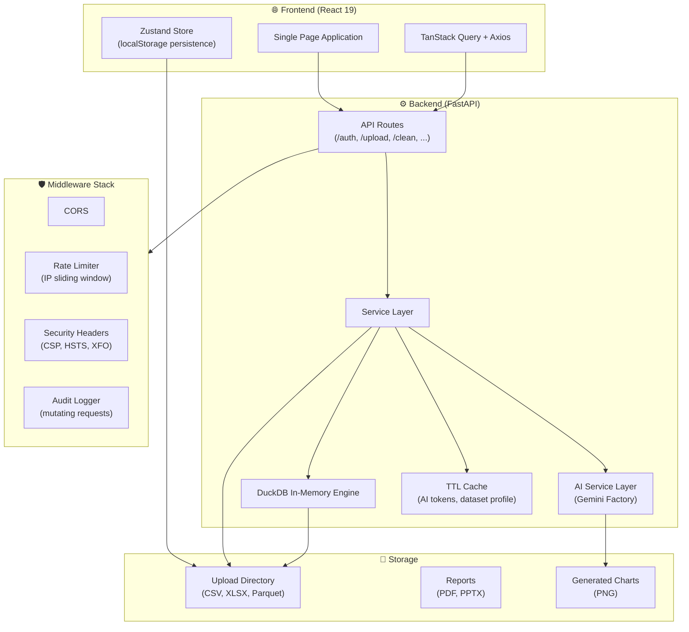
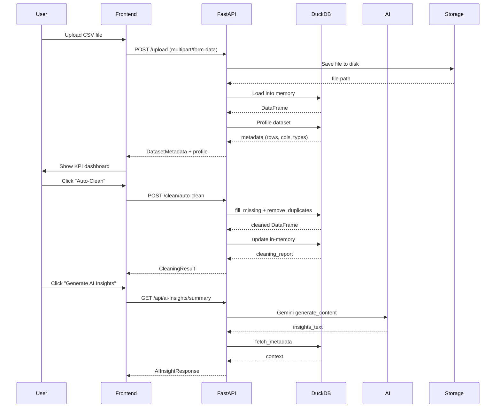
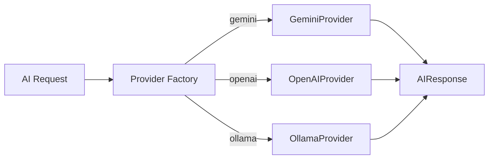
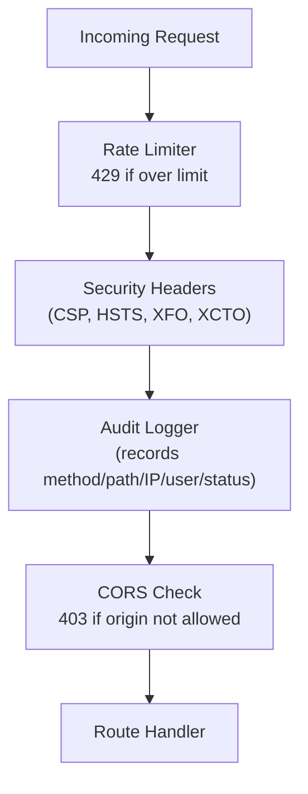
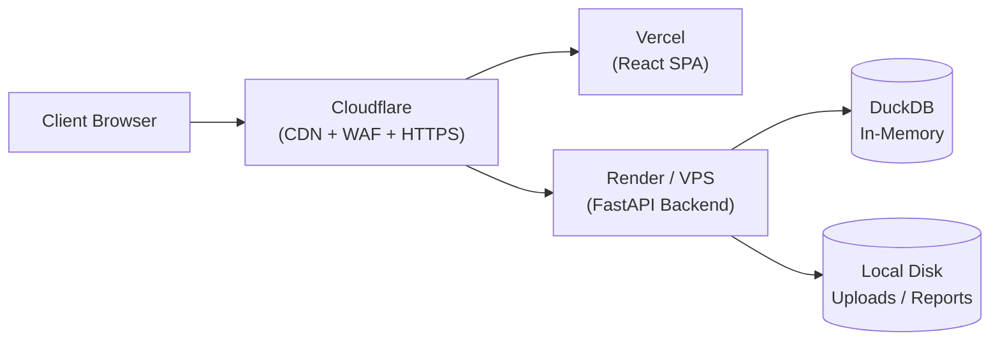

# Architecture Diagram

This file contains a Mermaid diagram that can be rendered to PNG/SVG using https://mermaid.live or the VSCode Mermaid plugin.

---

## System Component Diagram



## Request Lifecycle — Upload + Analyze



## AI Provider Factory



## Security Middleware Stack



## Deployment Architecture



---

## How to Render

### Option A — Mermaid Live (recommended for PNG export)
1. Open https://mermaid.live
2. Paste the diagram code (between the ```mermaid and ``` markers)
3. Click "Actions" → "PNG" or "SVG"
4. Save to `docs/architecture.png` (or `docs/architecture.svg`)

### Option B — VSCode Plugin
1. Install the "Markdown Preview Mermaid Support" extension
2. Open this file in VSCode
3. Right-click preview → "Open Preview" → right-click → "Copy Image"

### Option C — CLI with mermaid-cli
```bash
npm install -g @mermaid-js/mermaid-cli
mmdc -i docs/architecture-diagram.md -o docs/architecture.png -w 2400 -H 1600
```

### Option D — Python with mermaid-py
```python
import mermaid
diagrams = mermaid.parse_file("docs/architecture-diagram.md")
for name, code in diagrams.items():
    mermaid.render(code, f"docs/architecture-{name}.png", width=2400, height=1600)
```

After rendering, the diagrams will be available as PNGs in this `docs/` folder, ready to embed in the README.
